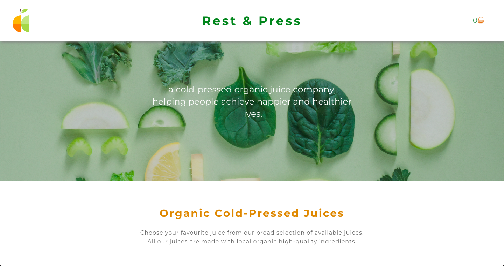
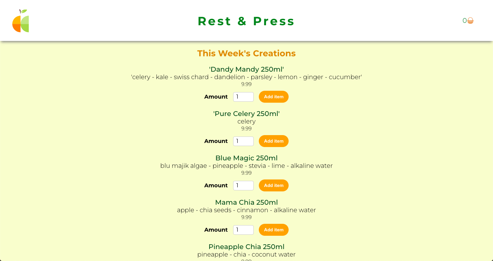
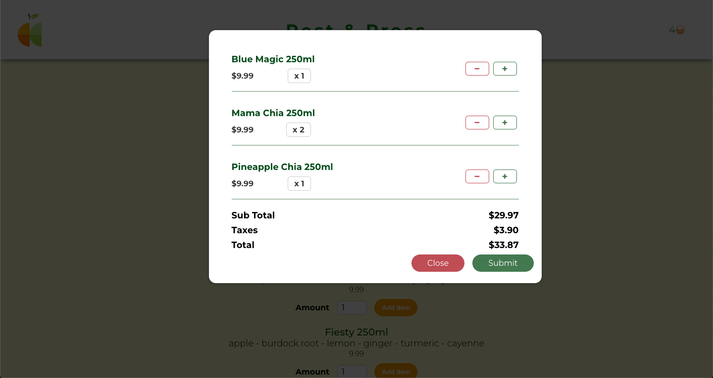
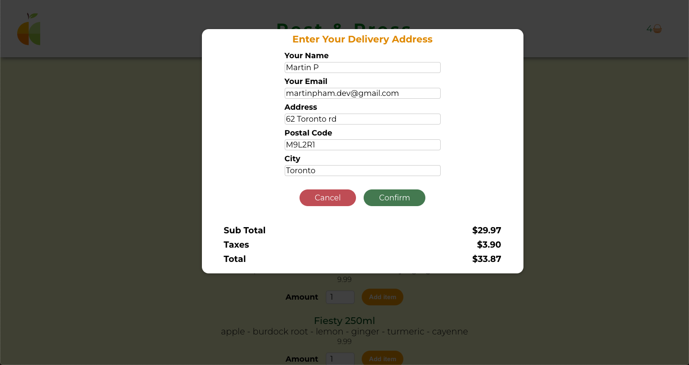
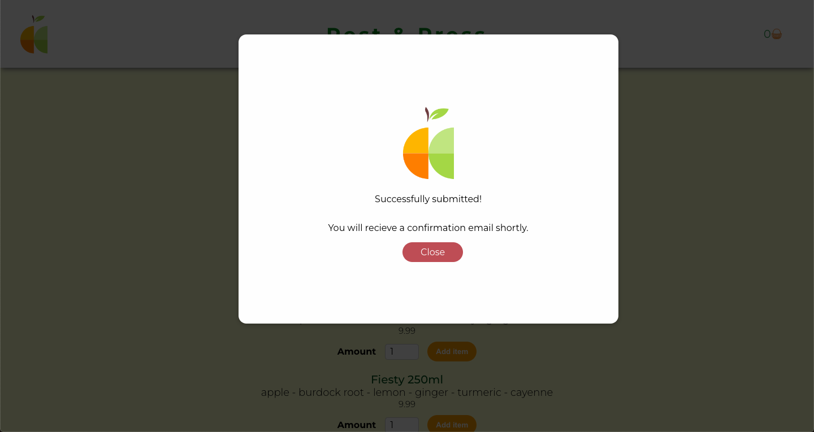

# Rest & Press

Rest & Press is a front-end juice delivery app that offers organic cold-press juices. Users choose juices to add to their cart and submit their order after entering their delivery information into a form. Once submitted, users recieve an order confirmation. Built using React, React Router, HTML, CSS, and Firebase.

## Features

### Firebase
* Menu items and orders are saved into a realtime database.

### Submit an order
* View all menu items.
* Select quantities to add to the cart.
* View and submit order in the cart.

## Final Product

#### <h3>Homepage;</h3>

#### <h3>View drinks and add to cart:</h3>

#### <h3>View your order in the cart:</h3>

#### <h3>Enter your address for delivery:</h3>

#### <h3>Recieve an order confirmation:</h3>

## Getting Started

In the project directory, you can run:

### `npm install`
Installs all the dependencies required for the app to run.

### `npm start`

Runs the app in the development mode.
Open [http://localhost:3000](http://localhost:3000) to view it in your browser.

